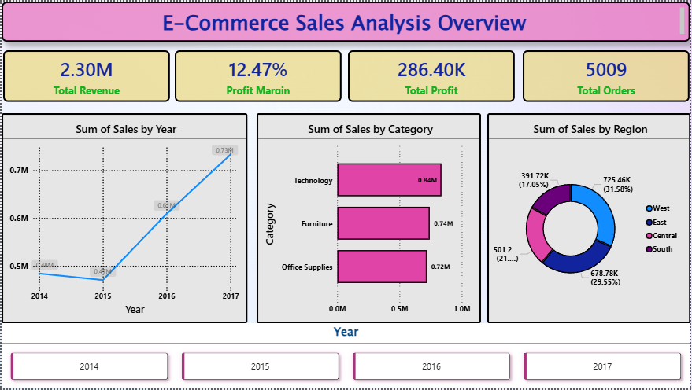

# 🛒 E-Commerce Sales Intelligence Dashboard

## 📌 Project Overview
This project is an end-to-end sales analytics solution built using **Python, SQL, and Power BI**.  
The objective was to analyze e-commerce retail data to uncover trends in **revenue, profitability, customer behavior, product performance, and regional sales**.

The project demonstrates the complete workflow of a Data Analyst:
- Data Cleaning using Python
- Exploratory Data Analysis (EDA)
- SQL Business Querying
- Interactive Dashboard Development in Power BI
- Business Insights & Recommendations

---

## 🎯 Objectives
- Track key business KPIs such as Revenue, Profit, Profit Margin, and Orders
- Identify high-performing and loss-making product categories
- Analyze customer contribution and segmentation
- Compare regional sales performance
- Support data-driven business decision making

---

## 🛠️ Tools & Technologies Used
- **Python** – Pandas, Matplotlib, Seaborn
- **SQL** – SQLite
- **Power BI** – Dashboard & Visualization
- **Jupyter Notebook**
- **GitHub**

---

## 📂 Dataset Information
- **Dataset Name:** Superstore Sales Dataset
- **Records:** ~9,994 Orders
- **Fields Included:**  
Order ID, Customer Name, Segment, Category, Sub-Category, Sales, Profit, Quantity, Discount, Region, State, Dates, Ship Mode

---

## 🔄 Project Workflow

### 1️⃣ Data Cleaning (Python)
- Removed duplicates
- Converted date columns
- Created Year / Month columns
- Calculated shipping duration
- Validated missing values

### 2️⃣ Exploratory Data Analysis
- Revenue trends over time
- Category-wise performance
- Profitability by sub-category
- Discount vs Profit analysis
- Monthly seasonality trends

### 3️⃣ SQL Analysis
Business queries performed:
- Total Revenue & Profit
- Top states by sales
- Customer segmentation
- Loss-making orders
- Monthly ranking
- Region-wise performance

### 4️⃣ Power BI Dashboard
Created a 3-page interactive report:
- Executive Summary
- Product Analysis
- Customer & Region Analysis

---

# 📊 Dashboard Pages

## 🔹 Page 1 – Executive Summary
Includes:
- Total Revenue
- Total Profit
- Profit Margin %
- Total Orders
- Revenue Trend
- Category Breakdown
- Regional Sales Distribution



---

## 🔹 Page 2 – Product Analysis
Includes:
- Profit by Sub-Category
- Loss-making products
- Sales vs Profit scatter chart
- Category treemap


---

## 🔹 Page 3 – Customer & Region Analysis
Includes:
- Top Customers
- Region-wise sales
- Segment analysis
- Geographic distribution


---

# 🔍 Key Insights

## 📌 Business Findings
1. **Tables** under Furniture generated negative profit despite good sales.
2. High discounts significantly reduced profitability.
3. Technology category contributed strong revenue.
4. A small group of customers generated a major share of sales.
5. Sales were concentrated in specific regions.

---

# 💡 Recommendations

- Review discount strategy for low-margin products.
- Optimize pricing for loss-making categories.
- Focus retention efforts on top customers.
- Increase marketing in high-performing regions.
- Improve inventory planning using seasonal trends.

---

# 📁 Repository Structure

```text
Ecommerce-Sales-Analysis/
│── README.md
│── superstore_dashboard.pbix
│── superstore_clean.csv
│── notebooks/
│   ├── 01_data_cleaning.ipynb
│   ├── 02_eda.ipynb
│   └── 03_sql_analysis.ipynb
│── screenshots/
│   ├── page1_overview.png
│   ├── page2_product.png
│   └── page3_customer_region.png
